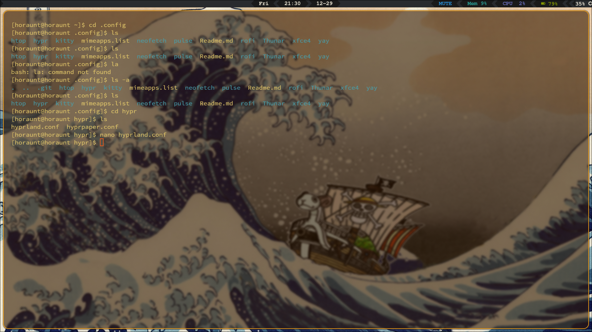

# Arch Linux Rice Dotfiles

This repository contains my personal dotfiles for my Arch Linux setup. It is customized for the Hyprland desktop environment.

## Features

- Desktop Environment: Hyprland
- Terminal Emulator: Kitty
- Application Manager: Rofi
- File Manager: Thunar
- Status Bar: Waybar
- Wallpaper Manager: Hyprpaper

## Screenshots



## Installation

To use these dotfiles, follow these steps:

1. Clone this repository:

   ```bash
   git clone https://github.com/horaunt/dotfiles.git
   ```

2. Install the required dependencies:

   - Hyprland: [Installation instructions](https://hyprland.com/installation)
   - Kitty: [Installation instructions](https://sw.kovidgoyal.net/kitty/#installation)
   - Rofi: [Installation instructions](https://github.com/davatorium/rofi#installation)
   - Thunar: [Installation instructions](https://docs.xfce.org/xfce/thunar/start)
   - Waybar: [Installation instructions](https://github.com/Alexays/Waybar#installation)
   - Hyprpaper: [Installation instructions](https://github.com/hyprwave/hyprpaper#installation)

3. Configure the dotfiles according to your preferences.

## Usage

- Launch Hyprland: `hyprland`
- Open Rofi: `rofi`
- Open Thunar: `thunar`
- Start Waybar: `waybar`
- Manage wallpapers with Hyprpaper: `hyprpaper`
- Open Kitty terminal: `kitty`

## License

This project is licensed under the [MIT License](LICENSE).
